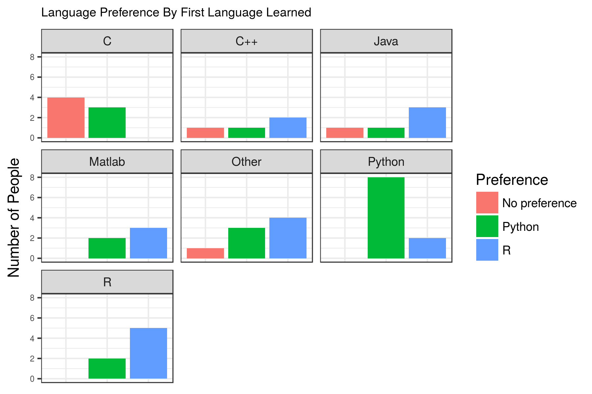

```{r setup, include=FALSE}
knitr::opts_chunk$set(echo = TRUE, fig.align='center',fig.pos = 'H')
```

```{r echo=FALSE, message=FALSE}
library(printr)
library(tidyverse)
```


### Survey Question

The question that we try and address in our survey is how much does the first programming language someone learn affect their preference of Python or R. 

\begin{figure}[h]
\centering
\includegraphics{../doc/r-vs-python-numbers.jpg}

\end{figure}

[picture credits](https://www.kdnuggets.com/2015/05/r-vs-python-data-science.html)

### Methods

#### Study Design

Survey experiments are susceptible to the effect of confounding variables(Simpson's paradox). We included a total of 6 question out of which 4 questions try and capture this effect -

- *Academic background*: respondents' academic background could affect both the first language they learnt as well the language they prefer. For example, the first language a computer science undergrad learnt might be C++. This person might prefer Python because it follows the object oriented paradigm as well. 
- *How did the respondent learn the first programming language (Academia/Online/Book)*: we included this question to assess the comfort level of someone with the first language that they learnt. This could also influence their choice of a programming language as someone who learnt Python in academia and learnt R from an online course might prefer Python over R.
- *How long ago did the respondent learn the first language?*: Python and R have gained severe traction over the last few years and could have played a pivotal role in the first language a person learnt. For this question, we had 4 bins into which we wanted to divide people. Those who learnt their 1st programming language less than a year ago, those who learnt it 1-3 years ago,3-5 years ago and ones who learnt it more than 5 years ago. We felt like we'd have equal representation across all 4 bins given the different backgrounds of the MDS cohort.
- *We asked people to rate between 1 and 5 about how much they agree with the statement - "The most important consideration in choosing a programming language is that it is employable"?*: knowledge of certain languages are viewed as an important employable tool. We felt like this could influence the first language learnt as well the preference of the respondent. We had this as a ranking question - 5 being I strongly agree with the statement and 1 for people who strongly disagree. 

We had an `Other` option for the first 2 questions instead of a text box for people who felt like their intended choice wasn't available. We felt like this would help with the analysis given the small sample size.

The survey questions were carefully picked and worded in order to reduce bias towards one of the languages. Link to the survey questions can be found [here](https://github.ubc.ca/ubc-mds-2017/mind-your-language/blob/master/doc/survey-outline.md)

#### Data Collection Methods

We chose the current MDS cohort(2017-18) as our sample as we wanted to specifically study the effect on a group that we know, has been exposed to both languages for approximately the same duration. We also had the TAs and the instructor for the DSCI 554 course respond to our survey. Data was collected during the lab session for the DSCI 554 course where the students were presented with a link to the survey. We used google forms to design the survey and recorded a total of 47 responses We were able to get the survey data in a `csv` format from google forms. Link to the raw survey data can be found [here](https://github.ubc.ca/ubc-mds-2017/mind-your-language/blob/master/data/raw-survey-data.csv).

#### Analysis Methods

Before any analysis was done, the survey data was first cleaned. Some answers were aggregated. For example, when asked about their first programming language in question one, many languages were reported using the 'Other' option that weren't explicitly offered as an option. The goal here was to ensure that no popular first-programming language was being missed in the question's listed offerings. This was in fact the case, with all such languages having no more than two respondents list them, and so they were aggregated into a generic 'Other' category.

Some answers were also reclassified according to the judgement of the authors. For example, in the question regarding academic background, answers such as 'Engineering' and 'Electronics Engineering' were offered via the 'Other' option. These fell under the umbrella of 'Physical Science (e.g. physics, biology, chemistry, earth sciences, non-software engineering)' and so were relabelled. For a full overview of how the data was cleaned, the code used for the cleaning is available [here](https://github.ubc.ca/ubc-mds-2017/mind-your-language/blob/master/src/cleaning_data.Rmd) and the cleaned data is available [here](https://github.ubc.ca/ubc-mds-2017/mind-your-language/blob/master/data/clean_survey_data.csv).

With the cleaned data, Fisher's exact test was performed on the count data of 'First Language' vs. 'Preferred Language'. Fisher's exact test was chosen instead of something like a chi-square test because some of the categories had few or no respondents (e.g. 'Python' and 'No Preference'), and a chi-square test is unreliable under such circumstances.

Once a potential relationship was established, three cases were considered. Three new variables were derived,

- `has_pref` -- A value of `1` if the respondent reported a preference (either Python *or* R), and `0` otherwise.
- `pref_R` -- A value of `1` if the respondent reported that they preferred R and `0` otherwise.
- `pref_Py` -- A value of `1` if the respondent reported that they preferred Python and `0` otherwise.

The goal here was to identify any sort of relationships between preferences and first languages, and, with this in mind, two separate logistic regressions were performed for each derived variable above, where the derived variables were treated as the target. All confounders were added to begin, and then those that appeared least significant were removed from the model until the target was only being regressed onto the first language with no confounders in the model. Releveling of the first language variable was also used to better identify any potentially significant relationships.

### Results and Analysis

The full analysis script can be found [here](https://github.ubc.ca/ubc-mds-2017/mind-your-language/blob/master/src/perform_analysis.Rmd) if an interested person would like to run it themselves.

#### Survey Results

Overall, similar numbers of people reported having a preference for Python and R, with fewer people reporting no preference. When compared by first programming language, it does appear that there could be some relationship between first language and preferred programming language,

```{r echo=FALSE}

```


#### Fisher's Exact Test

Moving onto more concrete tests of dependence, we considered the following contingency table,

```{r echo=FALSE}
load(file = "dat/cont_tbl.rda")
cont_tbl
```

Performing Fisher's exact test, where the null hypothesis corresponds to the two vectors being independent, a p-value of approximately $0.027$ was found,

```{r echo=FALSE}
fisher.test(cont_tbl) %>% broom::tidy()
```


#### Logistic Regression

As discussed above, logistic regression was performed with three separate target variables and six times overall. The full results can be found by running the analysis linked to above, but nearly all had similar results, generally with very large p-values well above the 5% significance level.

The one exception was when regressing whether or not a person preferred Python onto the first language chosen without any confounders in the model, with the first language being `R` chosen as the reference point.

```{r echo=FALSE}
load(file = "dat/py_no_conf.rda")
py_no_conf
```

The coefficient attached to a person's first language being Python was found to be different from a person's first language being R (i.e. the intercept) with a p-value of approximately $0.045$. 


### Discussion of Results

We performed Fisher's exact test and used several logistic regression models to analyze the data. From one of the regression models, we found a relationship between the first language a respondent learnt and their preferred programming language, but the relationship was not statistically significant.

From Fisher's exact test results, we get the p-value from the contingency table is 0.027. It's less than 0.05, so we could reject the null hypothesis at a 95% significance level. There is strong evidence to support that the first language learned and language preference are not independent.

As mentioned in the results section, even after releveling and changing which confounders were in the model, we only found one relationship that was significant at the 95% significance level. In a logistic regression with R as a first language as the reference point, we found that having Python as one's first language was positively associated with preferring Python with an associated p-value of approximately 0.045. After taking into account the multiple comparisons we made between the predictor (first language learned) and the outcome (language preference), using the Bonferroni correction, this finding would no longer be significant at the 95% significance level. With seven levels to the predictor, the adjusted p-value would be approximately 0.315. We lack the evidence to reject our null hypothesis by the logistic regression model.


### Discussion of Survey/Study Design 

A failure to identify any relationship between first language and preferred language could be evidence that there is none, but there other likely issues with the survey design having to do with sample size and the number of levels in the predictor that we considered.

We saw that adjusting the p-value for multiple comparisons led to our finding being considered non-significant. In further investigation, we suggest reducing the number of confounders and the number of levels in a variable. We should design more targeted survey rather than a too complicated model. A more directed study, perhaps directed specifically at people who learned either R or Python as their first language, might be better able to hone in the relationship that our study hints at.

Compounding the effect of having seven levels to the predictor variable that we considered is the fact that there were too few respondents. The power of this study was likely too small to have a realistic chance of identifying the relationship that were interested in. Increasing the number of respondents, in combination with the more directed study above or in a rerun of this study, would allow for a better chance of establishing or rejecting any relationship between first language learned and preferred language. Having only 45 respondents meant that some categories (e.g. first language learned being Matlab and having no preference between R and Python) had zero respondents in it, and others had only one or two.

In brief, based on our analysis in of people associated with the MDS program, we cannot conclude that there is a causal relationship between first language learnt and a person's preference between R and Python.